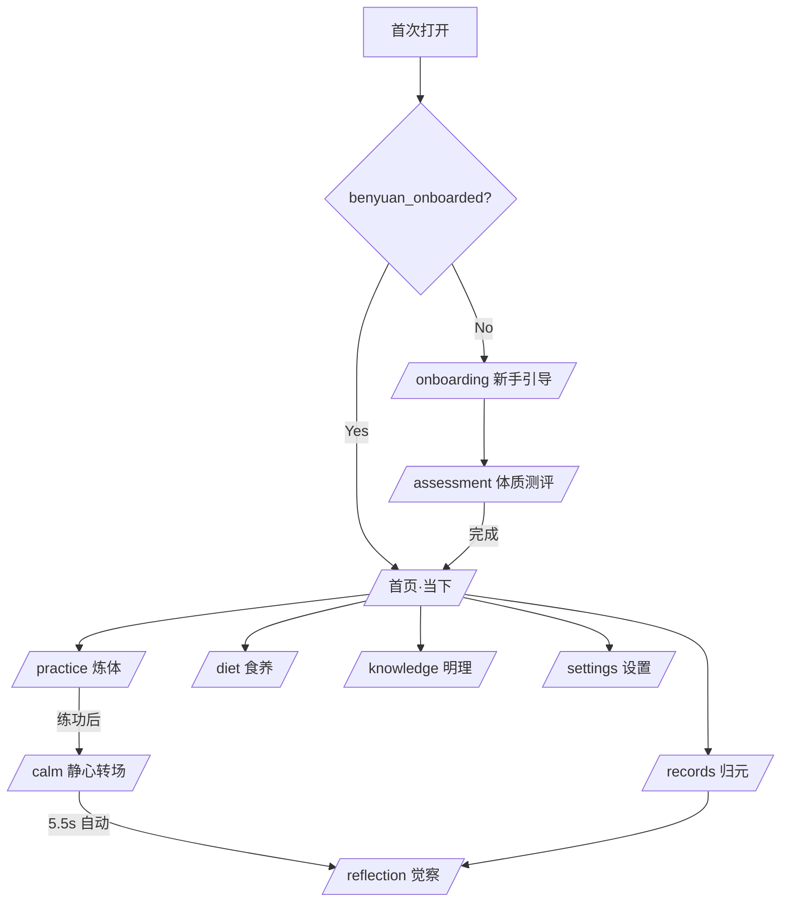
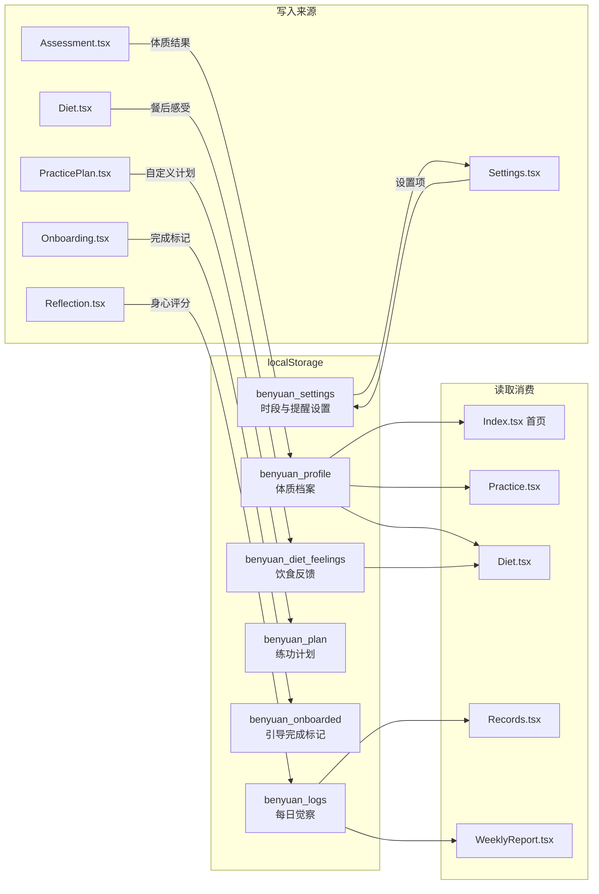
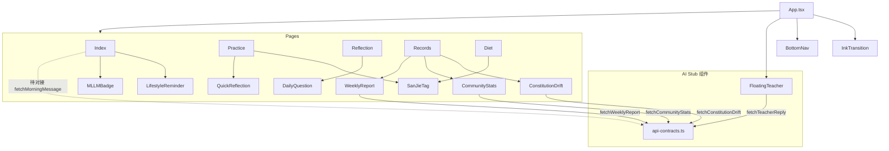
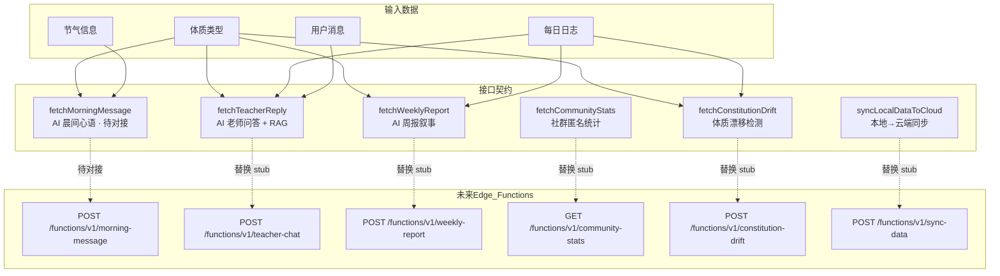
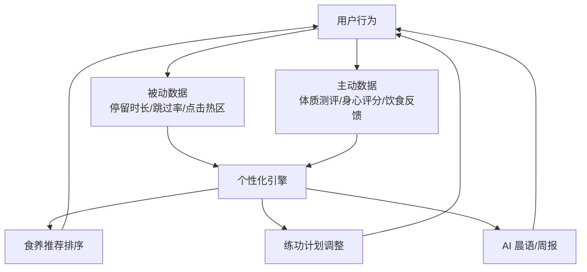

# 本元养生（BenYuan Wellness）· 架构与流程图

**最后对齐日期**：2026-02-21  

**Lovable 确认（2026-02-21）**：Cursor 的反馈确认了所有 9 条结论与 Lovable 上一轮回复完全一致，文档已对齐，无需额外修改。双方现在基于同一份 `docs/architecture.md` 作为事实来源，可继续推进后续工作。✅  

**Lovable 确认（流程图/说明）**：无其他流程图/说明需同步；本文件中的 6 张图即为当前全部架构文档。✅  

**4、关键代码**：路径与需求表完全一致；关键代码索引见 **`docs/key-code-index.md`**（8 类索引 + localStorage 键名）。Lovable 侧称同仓可访问；若其项目尚未同步至本仓库，需先同步后方能按索引路径访问代码。✅

**逐条结论**（统一以实现为准）：

| # | 结论 | 说明 |
|---|------|------|
| 1 | 以实现为准 | /calm 是练功**后**静心再去觉察，流程 F → J → L |
| 2 | 以 Tab 为准 | 不需要独立路由 /practice/plan，去掉 F → K |
| 3 | 以实现为准 | 暂仅首页进设置，去掉 I → M（后续可补） |
| 4 | 以实现为准 | 键名 `benyuan_logs` |
| 5 | 以实现为准 | 键名 `benyuan_plan` |
| 6 | 以实现为准 | Reflection.tsx 写入觉察数据 |
| 7 | 补充 | 加入 `benyuan_settings` |
| 8 | 以实现为准 | 修正首页子组件归属 |
| 9 | 本地生成，API 为后续 | fetchMorningMessage 标注「待对接」 |

---

## 一、用户主流程

> **核对说明**：
> - `/calm` 是练功**后**的静心过渡，自动跳转至 `/reflection`（非练功前）
> - 练功计划通过 Practice 页内 Tab「我的计划」管理，无独立路由
> - 设置入口目前仅在首页，归元页暂无

---

## 二、数据架构（localStorage → 未来 DB）

> **核对说明**：
> - 键名以实现为准：`benyuan_logs`（非 `benyuan_daily_logs`）、`benyuan_plan`（非 `benyuan_practice_plan`）
> - 觉察数据由 `Reflection.tsx` 写入（非 FeelingSlider）
> - 补充了 `benyuan_settings` 及 Settings.tsx

---

## 三、组件依赖关系

> **核对说明**：
> - 首页实际子组件：LifestyleReminder、MLLMBadge（VitalityOrb / FeelingSlider 未在首页使用）
> - DailyQuestion 归属 Reflection 页，QuickReflection 归属 Practice 页
> - 首页晨间心语目前为本地 `getMorningMessage()` 生成，`fetchMorningMessage` 标记为「待对接」

---

## 四、AI 接口契约（api-contracts.ts）

---

## 五、数据飞轮

---

## 六、关键文件索引

| 类别 | 文件 | 职责 |
|------|------|------|
| 路由入口 | `src/App.tsx` | 全部路由 + InkTransition + 全局浮层 |
| AI 契约 | `src/lib/api-contracts.ts` | 6 个 API stub + 类型定义 + DB schema 注释 |
| 体质逻辑 | `src/lib/profile-utils.ts` | 体质判定算法 + localStorage 读写 |
| 节气计算 | `src/lib/solar-terms.ts` | 24 节气日期 + 当前节气 |
| 时辰计算 | `src/lib/time-utils.ts` | 十二时辰 + 对应经络 |
| 设计系统 | `src/index.css` | Tailwind tokens + 水墨动画 + 色彩体系 |
| 音效 | `src/lib/sounds.ts` | Web Audio API 音效生成 |
