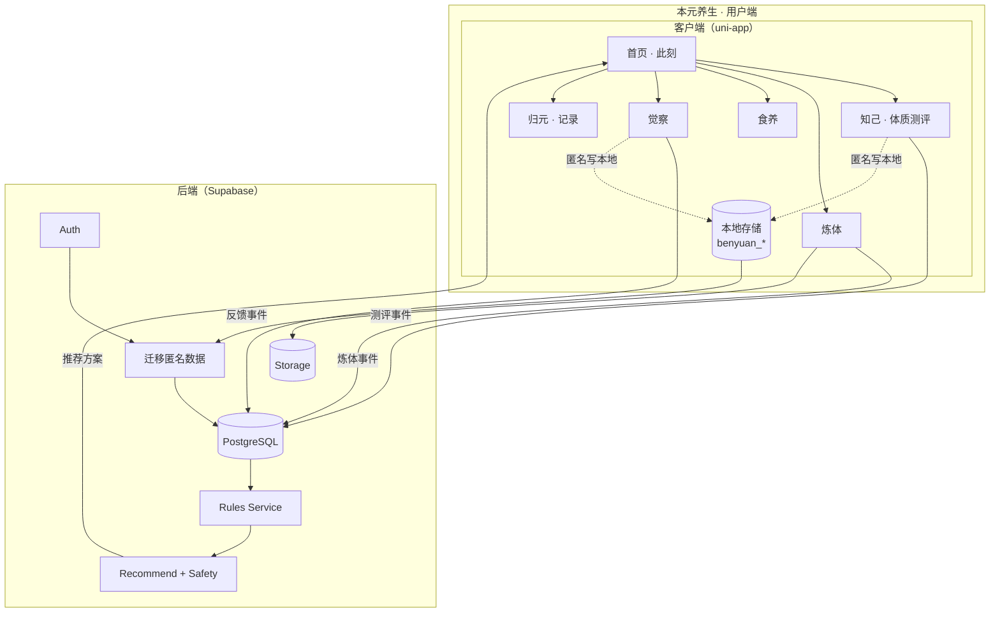
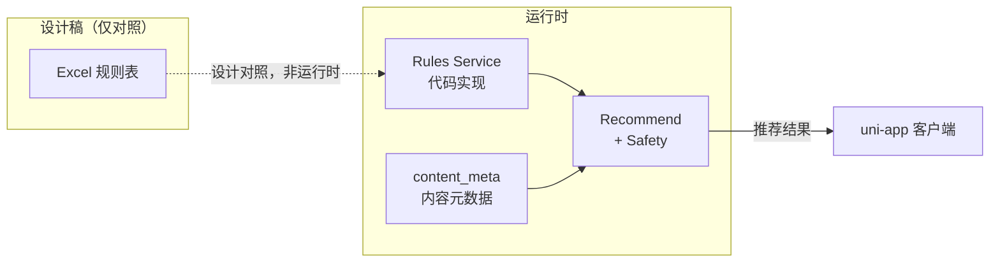
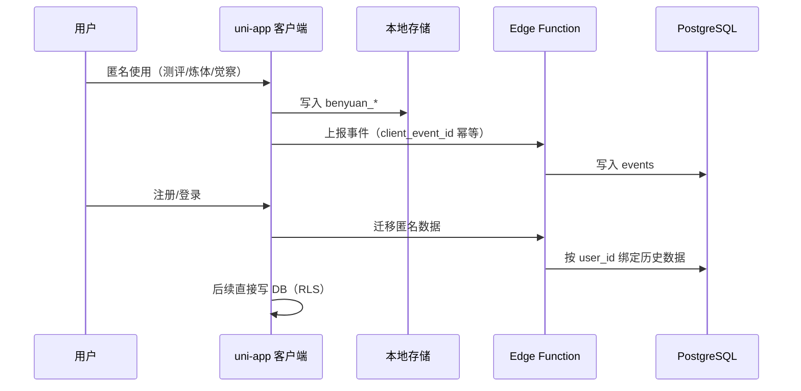

# 本元养生（BenYuan Wellness）· 技术架构说明

**项目名称**：本元养生（中文）/ BenYuan Wellness（英文）  
**版本**：开发前确认版 · 2026-02-21  
**用途**：开发前确认「用什么技术栈、怎么实现」的单一事实来源；供 Cursor 实现 uni-app 时遵循。规则逻辑在代码中实现，Excel 仅作设计对照。

---

## 开发前确认说明

- **产品架构说明书**（`docs/本元养生产品架构说明书_供V0与Lovable用.md`）：规定**做什么**——页面、流程、各页必备要素与数据，与 Lovable UI 一致。
- **技术架构说明**（本文）：规定**用什么技术栈、怎么实现**——客户端、后端、存储、规则与迁移策略。
- 实现时请同时遵守产品架构说明书与本文；**当前实现以本文技术选型为准**，若有变更请先更新本文再开发。

---

## 一、技术架构目标与约束

### 1.1 技术目标（MVP）

- 支持 **匿名先体验 → 后注册 → 数据迁移**
- 支持 **九种体质测评 + 身体运动测评**（评分与映射在代码中实现，与 Excel 设计稿一致）
- 支持 **体质/状态 → 炼体与饮食内容匹配**
- 支持 **视频内容交付**
- 支持 **用户连续行为与反馈记录**
- 支持 **多时区（基于设备时区）**

### 1.2 明确不做（MVP 阶段）

- 姿态识别、舌诊/面诊等多模态能力
- 子午流注精算（只保证本地时区 + 时段/时辰映射）
- 社交、排行榜、复杂统计分析
- **不以 Excel 导出物为运行时依赖**（规则逻辑在代码中实现，Excel 仅作设计对照）

---

## 二、总体原则

1. **规则逻辑进代码，单一事实来源**  
   以 Excel 为设计依据，在 Rules Service / 客户端 lib 中实现全部评分与推荐逻辑；Excel 不参与线上执行。

2. **事件优先于状态**  
   行为以事件记录，画像为聚合快照。

3. **先跑通闭环，再谈优化**  
   MVP 优先保证正确性、可解释性与可回滚。

4. **低权限、低摩擦**  
   不依赖地理定位，仅使用设备时区。

---

## 三、技术选型（开发前确认）

### 3.1 客户端（APP + 微信小程序）

| 项 | 选型 | 说明 |
|----|------|------|
| **框架** | **uni-app** | 一套代码覆盖微信小程序 + App，适合视频与连续使用；**当前实现以本选型为准**。 |
| **语法** | Vue 3 | uni-app 推荐 Vue 3 + Composition API。 |
| **本地存储** | uni 本地存储 API（`uni.setStorageSync` / `uni.getStorageSync`） | 键名与 `docs/key-code-index.md` 第 8 节完全一致（benyuan_profile、benyuan_logs 等）。 |
| **时区** | 设备时区 | 用于时段、时辰、节气计算，不写死 GMT+8。 |

### 3.2 后端与基础设施（MVP）

| 项 | 选型 | 说明 |
|----|------|------|
| **认证** | Supabase Auth | 注册 / 登录。 |
| **数据库** | PostgreSQL（Supabase） | 用户画像、事件、内容元数据。 |
| **存储** | Supabase Storage | 视频与静态资源；国内正式期可切换腾讯云 VOD。 |
| **规则与推荐** | Edge Functions / Rules Service | 推荐与匹配、安全闸门、匿名数据迁移。 |
| **匿名策略** | Edge Function 代理写入 | 不直接给匿名客户端 DB 写权限；注册后 RLS 按 user_id 限制。 |

### 3.3 视频与内容

- 内容上传后维护 **content_meta**（video_url、适用体质、禁忌、时段等）。
- 播放端按推荐结果拉取 content_meta，从 Storage/VOD 播放；支持熄屏常亮、静音/背景音切换。

---

## 四、开发阶段建议（实现时遵守）

1. **先本地、后云端**  
   首阶段所有读写以 uni-app 本地存储为主，键名严格按 `docs/key-code-index.md` 第 8 节；接口（晨间心语、周报、老师问答等）先本地 mock 或 stub，再择机对接 Supabase Edge Functions。

2. **键名与索引一致**  
   本地存储键名必须与 key-code-index 一致：benyuan_profile、benyuan_logs、benyuan_diet_feelings、benyuan_plan、benyuan_onboarded、benyuan_settings、benyuan_today。

3. **规则在代码中实现**  
   体质判定、饮食/炼体推荐等逻辑在客户端 lib（如 profile-utils）或后续 Rules Service 中实现，不依赖 Excel 导出流水线。

4. **路由与页面与产品架构一致**  
   路由与页面清单以产品架构说明书及 `docs/architecture.md` 为准；实现时参照 `docs/Lovable_UI与uni-app落地对照.md`。

---

## 五、技术架构流程图

### 5.1 系统分层与数据流

### 5.2 规则与内容关系（方案 B：逻辑在代码中实现）

### 5.3 匿名体验与注册迁移

---

## 六、数据与存储约定

### 6.1 本地存储键名（与 key-code-index 一致）

| 键名 | 用途 |
|------|------|
| benyuan_profile | 体质档案 |
| benyuan_logs | 每日觉察日志 |
| benyuan_diet_feelings | 饮食反馈 |
| benyuan_plan | 练功计划 |
| benyuan_onboarded | 引导完成标记 |
| benyuan_settings | 时段与提醒设置 |
| benyuan_today | 今日任务完成记录（由 `markComplete()` 统一更新：Diet/Practice 完成时写；Index 仅读取汇总展示） |

### 6.2 后端核心表（MVP，后续对接时用）

- **user_profile**：体质、疼痛标签、时区、updated_at  
- **assessment_events**：测评事件（含 client_event_id 幂等）  
- **practice_events**：炼体事件  
- **feedback_events**：主观反馈事件  
- **content_meta**：内容元数据（视频、适用体质、时段等）

> **事件幂等**：后续上报到后端的事件（assessment/practice/feedback）均应包含 `client_event_id`，后端按其幂等 upsert，防止断网重传重复入库。

---

## 七、与其它文档的关系

| 文档 | 用途 |
|------|------|
| `docs/本元养生产品架构说明书_供V0与Lovable用.md` | **产品**：做什么——页面、流程、各页必备要素与数据（与 Lovable UI 一致） |
| `docs/本元养生_技术架构说明.md` | **本文**：用什么、怎么实现——技术栈、分层、数据流、规则与迁移 |
| `docs/architecture.md` | 产品级流程图（用户主流程、数据架构、组件依赖、AI 契约等） |
| `docs/key-code-index.md` | 关键代码路径与 localStorage 键名索引（实现时路径与键名以此为准） |
| `docs/本元养生技术架构定稿版.md` | 技术架构定稿详版（规则方案 B、数据表、匿名迁移等，与本文一致） |

---

> **开发前确认**：动手实现前请确认已阅读**产品架构说明书**（与 Lovable UI 一致）与**本文**（技术选型与实现方式）；当前技术栈以本文为准，若有调整请先更新本文再开发。
