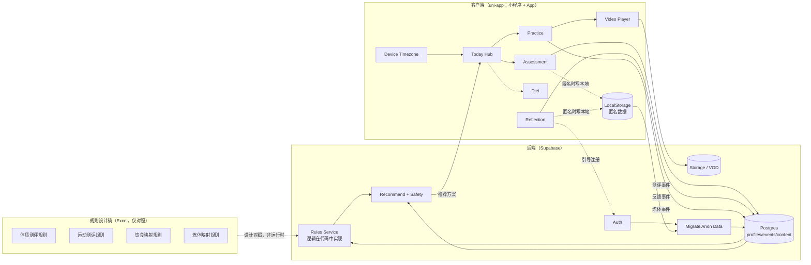

# 本元养生技术架构（含Mermaid架构图）

**定稿版 · 2026-02-20**  
规则落地采用 **方案 B**：评分与映射逻辑在 Rules Service 代码中实现，Excel 仅作设计稿与对照表，不依赖导出流水线。

---

## 一、技术架构目标与约束

### 1.1 技术目标（MVP）
本技术架构用于支撑「本元养生」MVP 阶段的完整闭环，核心目标包括：

- 支持 **匿名先体验 → 后注册 → 数据迁移**
- 支持 **九种体质测评 + 身体运动测评**（评分与映射逻辑在 Rules Service 代码中实现，与现有 Excel 设计稿一致）
- 支持 **体质/状态 → 炼体与饮食内容匹配**
- 支持 **视频内容交付**
- 支持 **用户连续行为与反馈记录**
- 支持 **多时区（基于设备时区）**

### 1.2 明确不做（MVP 阶段）
- 姿态识别、舌诊/面诊等多模态能力
- 子午流注精算（只保证本地时区 + 时段/时辰映射）
- 社交、排行榜、复杂统计分析
- **不以 Excel 导出物为运行时依赖**（规则逻辑在代码中实现，Excel 仅作设计参考）

---

## 二、总体技术架构原则

1. **规则逻辑进代码，单一事实来源**  
   以现有 Excel 中的题目、公式与映射为设计依据，在 Rules Service 中实现全部评分与推荐逻辑；Excel 仅作产品设计稿与对照表，不参与线上执行，避免双处维护。

2. **事件优先于状态**  
   所有用户行为都以「事件」记录，画像只是聚合快照。

3. **先跑通闭环，再谈优化**  
   MVP 阶段优先保证正确性、可解释性与可回滚。

4. **低权限、低摩擦**  
   不依赖地理定位权限，仅使用设备时区。

---

## 三、技术选型（最小成本、可演进）

### 3.1 客户端（APP + 微信小程序）
- **技术**：`uni-app`
- **原因**：
  - 一套代码覆盖微信小程序 + App
  - 适合视频播放、连续使用场景
- **能力**：
  - Today Hub / Assessment / Practice / Diet / Reflection
  - 本地匿名数据缓存（LocalStorage）
  - 设备时区识别

---

### 3.2 后端与基础设施
**推荐方案（MVP）：Supabase**

- **Auth**：注册 / 登录
- **Database**：PostgreSQL
- **Storage**：视频与静态资源
- **Edge Functions**：
  - 推荐与匹配（Rules Service 逻辑可在此或独立服务中实现）
  - 安全闸门
  - 匿名数据迁移

**RLS 与匿名写入策略（必读）**：MVP 阶段匿名事件写入通过 **Edge Function 代理**（不直接给匿名客户端 DB 写权限）；注册后客户端用 Auth token 直接写自己的数据，**RLS 按 user_id 限制**，避免匿名无法写入或一放开全库可写的高风险。

> 优点：极快落地、低运维成本  
> 后续可无痛迁移至自建 NestJS + PostgreSQL

---

### 3.3 视频与内容分发
- **视频存储**：
  - MVP：Supabase Storage
  - 国内正式期：可切换腾讯云 VOD
- **播放器能力**：
  - 静音 / 背景音切换
  - 熄屏常亮（端侧实现）

**视频内容上线链路（MVP）**：内容方拍摄并剪辑后，通过管理后台上传至 Supabase Storage，并在 content_meta 中维护该内容的 video_url、时长、适用体质、禁忌、适用时段等字段；无独立管理后台时，可采用 Supabase 控制台上传 + 手动维护 content_meta 表或简单录入页。播放端从 content_meta 取 video_url，经 Video Player 从 Storage/VOD 拉流播放。

---

## 四、规则架构（逻辑在代码中实现）

### 4.1 Excel 的角色定义（设计稿，非运行时）
Excel 在本系统中作为 **“规则设计稿与对照表”**，用于：

- 九种体质测评题目、权重、评分公式
- 身体运动能力测评公式
- 体质 / 状态 → 食物映射规则
- 体质 / 状态 → 炼体内容映射规则
- 禁忌与安全规则  
开发实现时以 Excel 为设计依据，Rules Service 的实现需与其中逻辑与结果保持一致，便于校验与迭代。**不参与线上执行**：不依赖“导出 Excel → 上传/部署”的流水线。

### 4.2 规则落地策略（方案 B：代码实现）
**采用：Rules Service 在代码中实现全部评分与映射逻辑**

#### 流程：
1. Excel 按约定 Sheet 结构维护，作为设计与对照
2. 在 Rules Service（或后端统一规则模块）中实现与 Excel 一致的：
   - 体质测评评分逻辑
   - 身体运动测评评分逻辑
   - 体质/状态 → 饮食内容映射
   - 体质/状态 → 炼体内容映射
   - 禁忌与安全规则判断
3. 版本与追溯：通过代码版本（Git）管理逻辑变更；测评/推荐结果可记录 **logic_version**（如 commit 或发布版本号）便于回溯

#### 优点：
- 单一事实来源，只维护代码
- 可测试、可 Code Review、可回滚
- 随用户量增加无需迁逻辑，仅做性能与扩展优化
- Excel 仅作设计稿，改规则时改代码即可

### 4.3 Rules Service 职责
- **输入**：当前 user_profile（体质、疼痛标签、时区、时段）、最近 N 条 feedback_events、当前时段、content_meta、请求上下文
- **输出**：炼体方案（content_id 列表及顺序）、饮食建议、安全等级（可执行/需提示/不建议）及可解释的中间依据
- **实现**：在代码中实现与 Excel 设计稿一致的评分公式与映射逻辑；不依赖运行时读取 Excel 或导出文件

### 4.4 规则与内容元数据的关系
- **content_meta**：存内容元数据（如 video_url、适用体质、禁忌、时段），常驻数据库，由内容上传/管理流程维护。
- **Rules Service**：根据 user_profile 与自身实现的映射逻辑得到推荐 content_id 列表及安全等级，再结合 content_meta 做校验与排序，输出最终推荐方案。

**RS 与 Recommend+Safety 的边界（定稿约定）**：**Rules Service** 负责「规则计算与候选集」；**Recommend+Safety** 负责「时段过滤 / 安全闸门 / 排序 / 兜底替代」，并且是**对外 API**。后续扩展（如加 LLM、AB test）时边界清晰，不混在一起。

---

## 五、数据架构（连续记录为核心）

### 5.1 数据模型设计原则
- **事件表记录一切**；所有客户行为（测评提交、炼体开始/结束、饮食推荐曝光与点击、主观反馈等）均以事件形式连续落库，不做抽样或仅汇总落库，以支持长期追踪、推荐迭代与数据迁移。
- **画像表只是聚合快照**
- 所有推荐结果都可追溯（可记录 logic_version）
- **所有匿名上报与迁移均以 client_event_id 做幂等处理**（见 5.2 各事件表），防止断网重传/重复提交造成多条重复事件。

### 5.2 核心数据表（MVP 最小集）

#### 1. user_profile（用户当前画像）
- user_id
- constitution_type
- pain_tags[]
- local_timezone
- risk_flags
- updated_at

#### 2. assessment_events（测评事件）
- event_id
- **client_event_id**（唯一，客户端生成的 UUID，幂等去重键）
- user_id / anon_id
- assessment_type（体质 / 运动）
- raw_answers
- scores
- result
- **logic_version**（可选，当时使用的规则逻辑版本，如 git tag 或 commit）
- created_at

#### 3. practice_events（炼体行为）
- event_id
- **client_event_id**（唯一，客户端生成的 UUID，幂等去重键）
- user_id / anon_id
- content_id
- duration
- completed
- **logic_version**（可选，当时推荐所用的逻辑版本，便于追溯）
- created_at

#### 4. feedback_events（主观反馈）
- event_id
- **client_event_id**（唯一，客户端生成的 UUID，幂等去重键）
- user_id / anon_id
- content_id
- feeling_score（放松/无感/不适）
- notes
- **logic_version**（可选，当时推荐所用的逻辑版本，便于追溯）
- created_at

#### 5. content_meta（内容元数据）
- content_id
- type（炼体 / 饮食）
- target_constitution[]
- target_body_parts[]
- applicable_time_slots[]
- forbidden_signs[]
- safety_level
- video_url
- version

---

## 六、推荐与安全闸门

### 6.1 推荐输入
- user_profile（体质 + 状态）
- 最近 N 条 feedback_events
- 当前时区 / 时段（由设备时区与本地时间计算，如 早餐/上午/午餐/下午/晚餐/睡前；规则与 content_meta 可包含适用时段，Recommend 按当前时段过滤与排序，不实现子午流注精算）
- content_meta
- 代码内实现的规则逻辑（无导出文件依赖）

### 6.2 推荐输出
- 炼体方案（内容列表 + 顺序）
- 饮食建议
- 安全提示（可执行 / 警告 / 不建议）

### 6.3 安全闸门（Safety Gate）
每一次推荐都经过安全校验：

- ✅ 可执行
- ⚠️ 需提示
- ⛔ 不建议（给替代内容）

---

## 七、匿名体验与数据迁移

### 7.1 匿名态
- 客户端生成 `anon_id`，与设备或会话绑定
- **每个事件（assessment / practice / feedback）需带 client_event_id（客户端生成的 UUID）**；后端入库以 **client_event_id 做幂等 upsert**，防止断网重传或重复提交造成多条重复事件
- 测评结果、炼体事件、反馈事件**先写入本地（LocalStorage）**，并建议在关键节点（如测评完成、炼体完成、反馈提交）以 anon_id **实时或批量上报**至后端，便于推荐与迁移时数据完整
- 注册后通过 Migrate Anon Data 将本地与已上报的匿名数据统一绑定到 user_id；**迁移过程同样以 client_event_id 做幂等处理**，避免重复绑定

### 7.2 注册后迁移
- 用户注册 / 登录
- 触发 `migrate_anon` 接口
- 将匿名数据绑定到 user_id
- 保证历史不丢失

---

## 八、技术架构图（Mermaid）

方案 B：规则逻辑在 Rules Service 中实现，Excel 仅作设计参考，无运行时导出流水线；匿名态下 Assessment / Reflection 会同时写 LocalStorage。

---

## 附录：方案 B 与初稿差异（便于对照）

| 项目 | 初稿（Excel 导出方案） | 方案 B（本文） |
|------|------------------------|----------------|
| 规则来源 | Excel 导出 → JSON/CSV → Ruleset Version → Rules Service 加载 | Rules Service 在代码中实现逻辑；Excel 仅作设计稿与对照，不参与运行时 |
| 规则版本 | ruleset_version（导出物版本） | logic_version（代码版本，如 Git tag/commit），可选记入 assessment / practice / feedback_events |
| 架构图 | 规则母本 → 规则导出流水线 → Ruleset Version → RS | 去掉导出流水线；Excel 以「规则设计稿」虚线指向 RS；AS/RF 增加写 LocalStorage 的虚线 |
| 1.2 明确不做 | “规则完全代码化重写（保留 Excel 母本）” | “不以 Excel 导出物为运行时依赖” |
